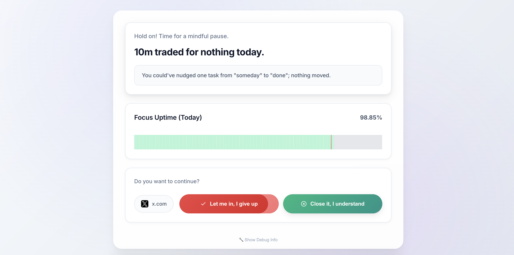

# Hold On

> Break free from mindless scrolling and redirect your energy toward what truly matters.

A browswer extension that helps you reclaim focus by intercepting visits to distracting websites and gently redirecting your attention toward meaningful activities.



## 🌟 Features

### ⏸️ Mindful Interventions
Get real-time awareness of your browsing habits before you get sucked into endless scrolling. Hold On creates a pause moment that helps you make intentional choices about your time.

### 🎯 Personalized Redirects
Based on your selected interests, receive gentle nudges toward activities that align with your goals—whether it's reading, exercising, cooking, or pursuing creative projects.

### 📊 Progress Tracking
See a uptime % for your mental focus with visual insights such as how frequently you get craving and how many interruptions you've successfully redirected into meaningful activities.

### 🌐 Flexible Website Blocking
- Pre-configured infamous sites (Instagram, YouTube, Facebook, TikTok, etc.)
- Add custom websites

## 🛠️ Installation

### For Development
1. Clone this repository:
   ```bash
   git clone https://github.com/your-username/hold-on.git
   cd hold-on
   ```

2. Open Chrome and navigate to `chrome://extensions/`

3. Enable "Developer mode" in the top right

4. Click "Load unpacked" and select the `extension` folder

5. The Hold On icon should appear in your Chrome toolbar

### From Chrome Web Store
*Not Yet Published - It will be available on the Chrome Web Store; but I don't have any planned timeline yet.*

## 🎨 How It Works

1. **Install & Setup**: Complete the 4-step onboarding process
2. **Browse Normally**: Continue using the web as usual
3. **Get Interrupted**: When visiting selected distracting sites, see an intervention page
4. **Make a Choice**: Either continue to the site or redirect to a focus activity
5. **Track Progress**: View your daily focus statistics and streaks

## Roadmap

- [ ] Privacy-focused local intervention slogan generation (using transformers.js or something else)
- [ ] Personas to generate Duolingo-style intervention slogans (i.e. asian mom, superheros, 

## 🤝 Contributing

Here's how you can help:
1. **Fork** the repository
2. **Create** a feature branch (`git checkout -b feature/amazing-feature`)
3. **Commit** your changes (`git commit -m 'Add amazing feature'`)
4. **Push** to the branch (`git push origin feature/amazing-feature`)
5. **Open** a Pull Request

## 📞 Support

Having issues or questions?: Please create [issue](https://github.com/pravj/hold-on/issues)

